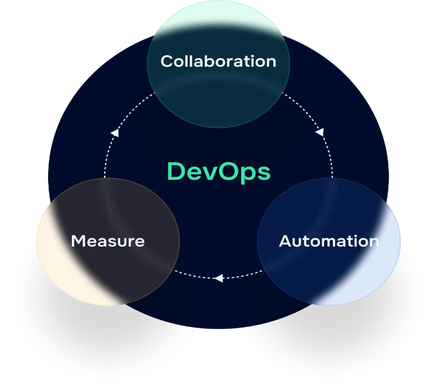

# ☁️ DevOps · SRE · Cloud Engineering

This space highlights key technology solutions that have been successfully implemented, along with well-considered recommendations for future use. The goal is to provide valuable insights and guidance that benefit teams across the organization.

---

## 📋 Topics Covered

Wide areas of topics covered — AI / DevOps / SRE Cloud key Principles/Practices:

| Area | Focus |
|---|---|
| ☁️ **Cloud** | AWS, GCP, Azure |
| 📦 **Containers** | Kubernetes and Docker |
| ⛵ **Helm** | Kubernetes package management |
| 🕸️ **Istio** | Service mesh |
| 🔄 **GitOps** | ArgoCD |
| 🏗️ **IaC** | Terraform |
| 🚀 **CI/CD Automation** | Pipeline design and delivery |
| 📊 **Observability Stack** | Monitoring, logging, tracing |
| 🤝 **Agile Scrum** | Delivery practices |

## 🎯 Why This Repository

Modern platform engineering sits at the intersection of Cloud, DevOps, SRE, and — increasingly — AI. This repository is a working reference of solutions that have been implemented in production environments, distilled into patterns and recommendations that other teams can reuse rather than rediscover from scratch.

## 🧭 How to Navigate

Each topic area above groups together the patterns, configuration references, and lessons learned from real implementations. Start with the topic closest to what you're solving for, and use the recommendations as a starting point rather than a copy-paste template — every environment has its own constraints.

## 👥 Who This Is For

- Platform, DevOps, and SRE engineers looking for field-tested patterns
- Cloud architects evaluating AWS / GCP / Azure trade-offs
- Teams adopting GitOps, service mesh, or IaC for the first time
- Anyone benchmarking their CI/CD and observability maturity

## 🤝 Contributing & Feedback

This is a living, evolving space. If something here helped your team, or you'd like to discuss an approach, feel free to open an issue or connect directly.

## 👤 Author

**Vishvendra Singh** — AI Engineer • Technology Leader • Innovation • Strategy • Governance • Observability • DevOps • SRE • Cloud • Open-Source Contributor

[LinkedIn](https://www.linkedin.com/in/vishvendrasingh1) · [GitHub](https://github.com/Vish-TechOps)

